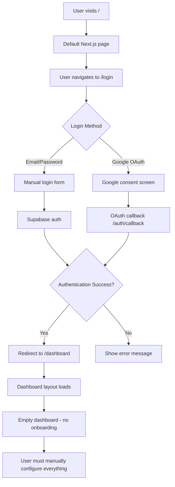

# Complete User Signup Flow Analysis

## 🔍 **Current Authentication System Overview**

Based on the codebase analysis, here's the complete user signup and onboarding flow from start to finish:

## 📋 **User Signup Flow: Start to Finish**

### **1. Initial User Access**
```
User visits application → Root page (/) → Default Next.js landing page
```

**Current State:**
- **Landing Page**: Basic Next.js template (`src/app/page.tsx`)
- **No dedicated signup page**: Only login functionality exists
- **Authentication Method**: Supabase Auth with Google OAuth

### **2. Authentication Entry Points**

#### **Login Page** (`/login`)
- **Location**: `src/app/login/page.tsx`
- **Methods Available**:
  - **Email/Password**: Traditional login form
  - **Google OAuth**: Single-click Google authentication
- **Redirect**: After successful login → `/dashboard`

#### **Google OAuth Flow**
```
User clicks "Google" → Supabase OAuth → Google consent → Auth callback → Dashboard
```

**Technical Flow:**
1. `supabase.auth.signInWithOAuth({ provider: 'google' })`
2. Redirect to Google OAuth consent screen
3. Google redirects to `/auth/callback`
4. Auth callback exchanges code for session
5. User redirected to dashboard

### **3. Authentication Callback** (`/auth/callback`)
- **Location**: `src/app/auth/callback/route.ts`
- **Purpose**: Handles OAuth callback and session creation
- **Process**:
  ```typescript
  const { error } = await supabase.auth.exchangeCodeForSession(code)
  if (!error) {
    return NextResponse.redirect(`${origin}${next}`)
  }
  ```

### **4. Session Management**
- **Middleware**: `src/middleware.ts` + `src/utils/supabase/middleware.ts`
- **Purpose**: Refreshes sessions on every request
- **Scope**: All routes except API, static files, and favicon

### **5. Post-Authentication: Dashboard Access**

#### **Dashboard Layout** (`/dashboard/layout.tsx`)
- **Authentication Check**: Implicit through Supabase RLS
- **Navigation Structure**:
  ```
  📊 Overview
  🎯 Lead Management → Lead Database, Offers & CTAs
  📧 Outreach Hub → Campaign Builder, Strategic Follow-ups
  🤖 AI Inbox → Reply Management
  📅 Calendar System → Booking Links, Calendar Hosts
  📈 Analytics → Performance Metrics
  ⚙️ Settings → All Configurations
  ```

### **6. Database User Creation**

#### **Automatic User Record Creation**
- **Supabase Auth**: Creates record in `auth.users` table automatically
- **User ID**: UUID generated by Supabase
- **No Custom User Profile Table**: System relies on `auth.users` only

#### **User-Specific Data Tables** (Created on-demand)
All tables reference `auth.users(id)` with CASCADE DELETE:

1. **Leads** (`public.leads`)
   - User's lead database
   - RLS: Users can only access their own leads

2. **Replies** (`public.replies`)
   - AI-analyzed email responses
   - RLS: Users can only view their own replies

3. **User API Keys** (`public.user_api_keys`)
   - Enrichment provider API keys
   - RLS: Users can only manage their own keys

4. **Outreach System**:
   - `outreach_campaigns`
   - `outreach_queue`
   - `offers`

5. **Calendar System**:
   - `booking_links`
   - `bookings`
   - `booking_availability`
   - `calendar_hosts`

6. **Follow-up System**:
   - `follow_up_events`

## 🚨 **Current System Gaps**

### **Missing Components:**

1. **No Dedicated Signup Page**
   - Users can only login, not explicitly sign up
   - Google OAuth handles both login and signup implicitly

2. **No User Onboarding Flow**
   - No welcome screen or setup wizard
   - No initial configuration prompts
   - Users land directly in empty dashboard

3. **No User Profile Management**
   - No custom user profile table
   - No user preferences or settings storage
   - Relies entirely on Supabase auth metadata

4. **No Initial Data Setup**
   - No default offers, CTAs, or templates
   - No guided setup for API keys
   - No sample data or tutorials

## 🔄 **Actual Current Flow**



## 📊 **Database Schema on User Creation**

### **Automatic Creation:**
```sql
-- Supabase automatically creates:
INSERT INTO auth.users (id, email, ...) VALUES (uuid, email, ...);
```

### **On-Demand Creation:**
```sql
-- Tables are created empty, populated as user uses features:
-- leads table - empty until user adds leads
-- user_api_keys table - empty until user configures API keys
-- replies table - empty until email integration setup
-- booking_links table - empty until user creates booking links
-- etc.
```

## 🎯 **Recommended Improvements**

### **1. Add Dedicated Signup Page**
```typescript
// src/app/signup/page.tsx
export default function SignupPage() {
  // Similar to login but with signup-specific messaging
  // Could include terms acceptance, initial preferences
}
```

### **2. Create User Onboarding Flow**
```typescript
// src/app/onboarding/page.tsx
export default function OnboardingPage() {
  // Step-by-step setup wizard:
  // 1. Welcome & account setup
  // 2. API keys configuration
  // 3. First lead import
  // 4. Email integration setup
  // 5. Calendar setup
}
```

### **3. Add User Profile Table**
```sql
CREATE TABLE public.user_profiles (
    id UUID PRIMARY KEY REFERENCES auth.users(id) ON DELETE CASCADE,
    full_name TEXT,
    company TEXT,
    role TEXT,
    timezone TEXT DEFAULT 'UTC',
    onboarding_completed BOOLEAN DEFAULT false,
    preferences JSONB DEFAULT '{}',
    created_at TIMESTAMPTZ DEFAULT now(),
    updated_at TIMESTAMPTZ DEFAULT now()
);
```

### **4. Implement Progressive Onboarding**
- **First Login Detection**: Check if `onboarding_completed = false`
- **Guided Setup**: Step-by-step configuration
- **Default Data**: Provide sample offers, CTAs, templates
- **Feature Discovery**: Highlight key features progressively

### **5. Enhanced Landing Page**
```typescript
// src/app/page.tsx - Replace default with:
export default function LandingPage() {
  return (
    <div>
      <Hero />
      <Features />
      <Pricing />
      <CTASection /> {/* Sign up / Login buttons */}
    </div>
  );
}
```

## 🔐 **Security & Data Flow**

### **Row Level Security (RLS)**
- **All user tables** have RLS enabled
- **Policy Pattern**: `auth.uid() = user_id`
- **Data Isolation**: Users can only access their own data

### **Authentication Flow**
```
Supabase Auth → JWT Token → RLS Policies → Data Access
```

### **Session Management**
- **Middleware**: Refreshes sessions automatically
- **Client-side**: Supabase client handles token refresh
- **Server-side**: Server client validates sessions

## 📈 **Current User Journey**

### **New User Experience:**
1. **Discovery**: User finds application (no marketing site)
2. **Authentication**: User must find `/login` manually
3. **First Login**: Lands in empty dashboard with no guidance
4. **Configuration**: Must manually discover and configure all features
5. **Usage**: Starts using features after self-guided exploration

### **Returning User Experience:**
1. **Access**: Direct login via `/login`
2. **Dashboard**: Familiar interface with their data
3. **Features**: Access to configured features and data

## 🚀 **Recommended Complete Flow**

### **Ideal New User Journey:**
```
Landing Page → Sign Up → Email Verification → Onboarding Wizard → Dashboard
```

### **Onboarding Wizard Steps:**
1. **Welcome & Profile Setup**
2. **API Keys Configuration** (with explanations)
3. **First Lead Import** (CSV upload or manual entry)
4. **Email Integration Setup** (Nylas configuration)
5. **Calendar Setup** (booking links creation)
6. **Dashboard Tour** (feature highlights)

---

## 📋 **Summary**

**Current State**: Basic authentication with Google OAuth, no onboarding, users land in empty dashboard

**Missing**: Dedicated signup page, user onboarding, profile management, guided setup

**Recommendation**: Implement comprehensive onboarding flow with progressive feature discovery and guided configuration

The system currently handles authentication well but lacks user experience polish for new user acquisition and retention.
